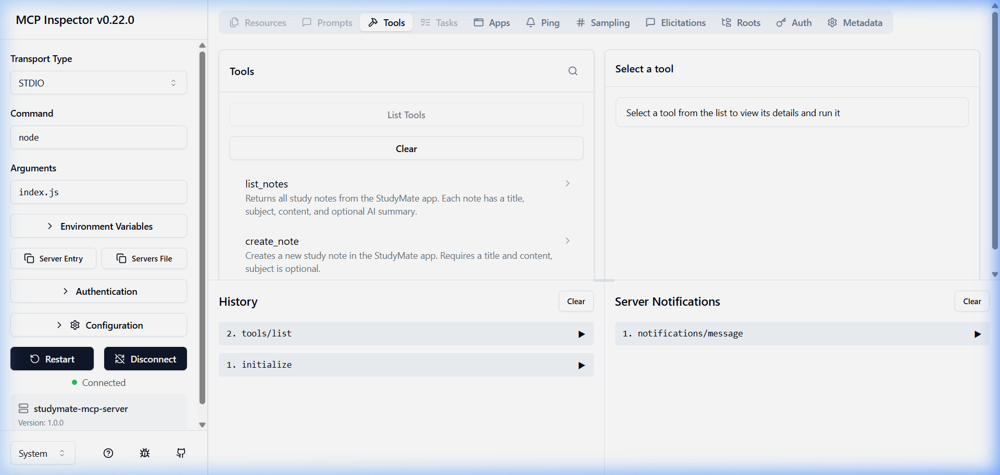
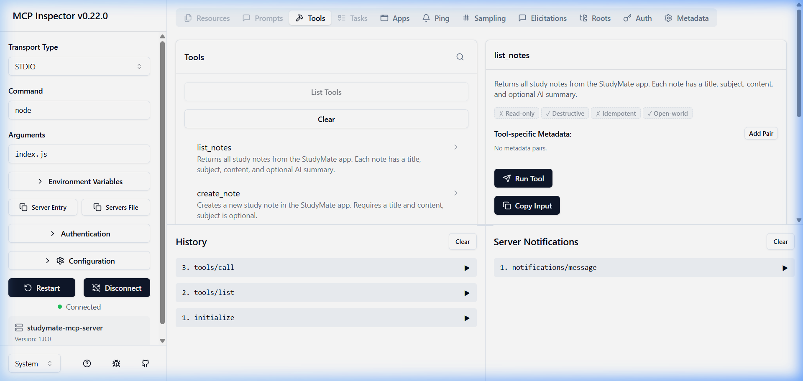
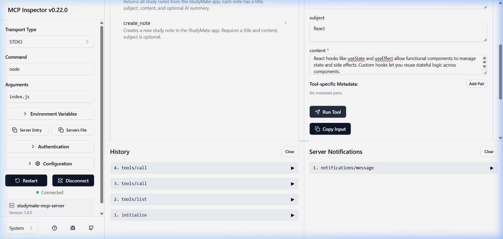
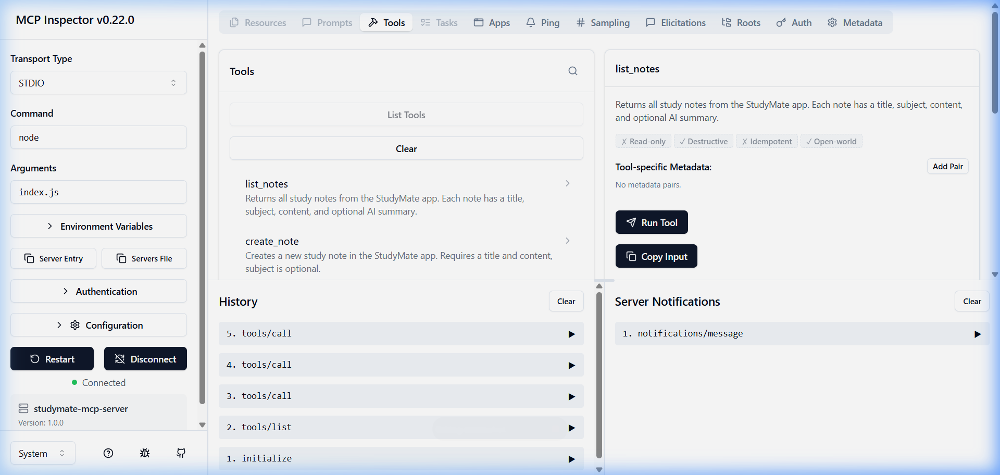

# StudyMate — AI-Powered Study Notes App

A complete full-stack app where students can keep study notes, get AI summaries, and manage notes from Claude via a custom MCP server.

## 📁 Project Structure

```
studymate/
├── landing/          # Part 1 — Static marketing page (HTML + CSS + vanilla JS)
├── client/           # Part 2 — Vite + React frontend
├── server/           # Part 3 — Express + MongoDB API  &  Part 4 — AI Integration
└── mcp-server/       # Part 5 — MCP server (stdio)
```

## 🚀 Quick Start

### 1. Server (Express API)
```bash
cd server
npm install
# Create .env file with MONGO_URI, GEMINI_API_KEY, PORT
npm run dev
```

### 2. Client (React)
```bash
cd client
npm install
npm run dev
```

### 3. Landing Page
```bash
cd landing
# Open index.html in a browser, or:
npx -y http-server -p 8080
```

### 4. MCP Server
```bash
cd mcp-server
npm install
npm start
# Or test with MCP Inspector:
npx @modelcontextprotocol/inspector node index.js
```

---

## Part 1 — Landing Page

Static marketing page with:
- Hero section with app name, one-line pitch, and "Open App" button
- 3 feature cards using Flexbox/Grid
- Vanilla JS interactions: FAQ accordion, dark-mode toggle, and typing effect
- Custom CSS with hover states, responsive design below 768px

## Part 2 — React Frontend

Vite + React app with:
- Notes list fetched from API (`useEffect` + `fetch`)
- Add-note form with title, subject, content (controlled components)
- Delete note functionality
- Search box for client-side filtering by title/subject
- Loading and empty states
- Components: `App`, `NoteForm`, `NoteCard`

## Part 3 — Express + MongoDB API

RESTful API with:
- `GET /api/notes` — list all notes
- `POST /api/notes` — create a note (with validation)
- `DELETE /api/notes/:id` — delete a note
- Mongoose model: `title`, `subject`, `content`, `createdAt`, `summary`
- MongoDB Atlas connection
- CORS enabled
- Input validation (empty title/content → 400 error)

## Part 4 — AI Integration

- `POST /api/notes/:id/summarize` — sends note content to Gemini API
- Prompt generates: 3 bullet-point summary + 1 quiz question
- "AI Summary" button in React with loading state
- Summary saved on note document (survives refresh)

## Part 5 — MCP Server

A Node MCP server over stdio with two tools:

### Tools
- **`list_notes`** — Returns all notes by calling the Express API
- **`create_note`** — Adds a note with `title`, `subject`, `content` inputs

### MCP Inspector Proof Screenshots

**Tools Registered (list_notes & create_note):**



**list_notes Tool Call — Returns existing notes:**



**create_note Tool Call — Creating "React Hooks Overview":**



**list_notes After create_note — Both notes listed:**



### Claude Desktop Configuration

To connect to Claude Desktop, add to `claude_desktop_config.json`:

```json
{
  "mcpServers": {
    "studymate": {
      "command": "node",
      "args": ["C:/Users/thara/Documents/Final/mcp-server/index.js"]
    }
  }
}
```

---

## Environment Variables

Create a `.env` file in the `server/` directory:

```env
MONGO_URI=your_mongodb_connection_string
GEMINI_API_KEY=your_gemini_api_key
PORT=5000
```

> ⚠️ Never commit the `.env` file. See `.env.example` for the template.

## Tech Stack

- **Frontend:** Vite + React
- **Backend:** Express.js + Node.js
- **Database:** MongoDB Atlas + Mongoose
- **AI:** Google Gemini API
- **MCP:** @modelcontextprotocol/sdk (stdio transport)
- **Landing:** HTML + CSS + Vanilla JavaScript
