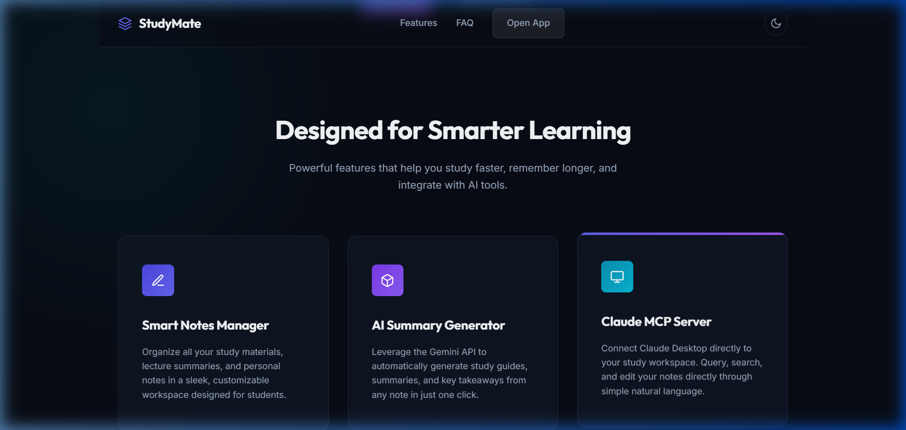
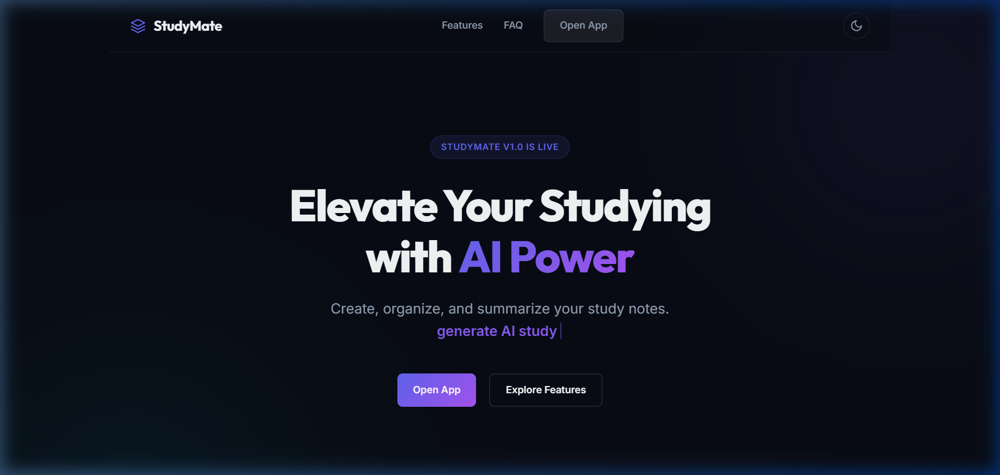
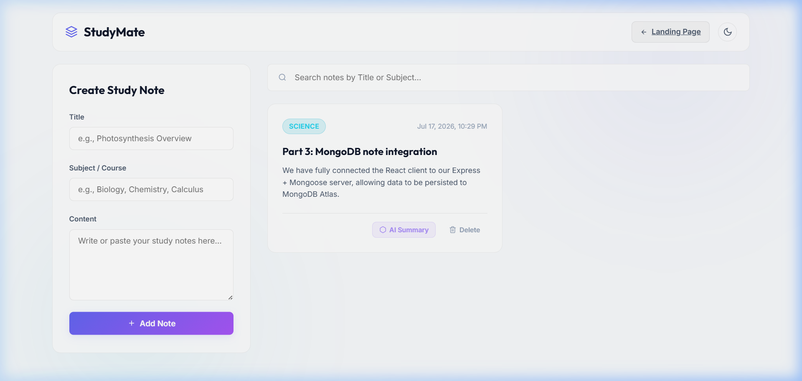
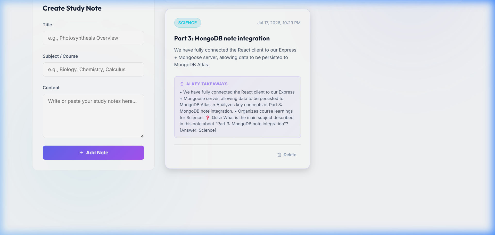

# 📚 StudyMate — AI-Powered Study Notes App

A complete full-stack application where students can organize study notes, generate AI-powered summaries with quiz questions, and manage everything through Claude via a custom MCP server.

---

## 🖼️ Screenshots

### Landing Page — Hero & Feature Cards


### Landing Page — Feature Cards & Dark Mode



### React Dashboard — Notes & Search


### AI Summary — 3-Bullet Summary + Quiz Question


### MCP Server — Tool Calls in Inspector


---

## 🛠️ Tech Stack

| Layer        | Technology                                      |
|-------------|--------------------------------------------------|
| Landing     | HTML5, CSS3, Vanilla JavaScript                   |
| Frontend    | Vite + React 19                                  |
| Backend     | Express.js, Node.js                              |
| Database    | MongoDB Atlas + Mongoose                         |
| AI          | Google Gemini API (`@google/generative-ai`)      |
| MCP Server  | `@modelcontextprotocol/sdk` + Zod (stdio)        |
| Validation  | Zod (MCP), Mongoose validators (API)             |

---

## 📁 Project Structure

```
studymate/
├── landing/            # Part 1 — Static marketing page (HTML + CSS + JS)
│   ├── index.html
│   ├── style.css
│   └── script.js
├── client/             # Part 2 — Vite + React frontend
│   ├── src/
│   │   ├── App.jsx
│   │   ├── App.css
│   │   └── components/
│   │       ├── NoteForm.jsx
│   │       └── NoteCard.jsx
│   └── package.json
├── server/             # Part 3 & 4 — Express API + AI integration
│   ├── server.js
│   ├── models/
│   │   └── Note.js
│   ├── .env.example
│   └── package.json
├── mcp-server/         # Part 5 — MCP server (stdio)
│   ├── index.js
│   └── package.json
├── screenshots/        # Proof screenshots for README
├── .gitignore
└── README.md
```

---

## 🚀 Setup & Installation

### Prerequisites
- **Node.js** v18+ installed
- **MongoDB Atlas** account (or local MongoDB)
- **Gemini API Key** from [Google AI Studio](https://aistudio.google.com/apikey)

---

### 1️⃣ Clone the Repository
```bash
git clone https://github.com/TRDhananjaya/MERN_Final.git
cd MERN_Final
```

---

### 2️⃣ Server Setup (Express + MongoDB API)

```bash
cd server
npm install
```

Create a `.env` file from the template:
```bash
cp .env.example .env
```

Edit `.env` with your actual credentials (see [Environment Variables](#-environment-variables) below).

Start the development server:
```bash
npm run dev
```
> Server runs on `http://localhost:5000`

---

### 3️⃣ Client Setup (Vite + React)

```bash
cd client
npm install
npm run dev
```
> React app runs on `http://localhost:5173`

---

### 4️⃣ Landing Page

```bash
cd landing
# Option A: Open index.html directly in your browser
# Option B: Use a local server
npx -y http-server -p 8080
```
> Landing page at `http://localhost:8080`

---

### 5️⃣ MCP Server

```bash
cd mcp-server
npm install
```

**Test with MCP Inspector:**
```bash
npx @modelcontextprotocol/inspector node index.js
```

**Connect to Claude Desktop** — add to your `claude_desktop_config.json`:
```json
{
  "mcpServers": {
    "studymate": {
      "command": "node",
      "args": ["/absolute/path/to/mcp-server/index.js"]
    }
  }
}
```

> ⚠️ The Express server must be running on port 5000 for MCP tools to work.

---

## 🔐 Environment Variables

Create `server/.env` using `server/.env.example` as a template:

```env
# MongoDB connection string from Atlas dashboard
# Make sure the password is URL-encoded and IP access list allows your IP
MONGO_URI=mongodb+srv://<username>:<password>@cluster.mongodb.net/studymate

# Port the Express server listens on
PORT=5000

# Gemini API key from Google AI Studio (https://aistudio.google.com/apikey)
GEMINI_API_KEY=YOUR_GEMINI_API_KEY
```

| Variable        | Required | Description                                                                 |
|----------------|----------|-----------------------------------------------------------------------------|
| `MONGO_URI`    | ✅ Yes    | MongoDB Atlas connection string. URL-encode your password if it has special characters. |
| `PORT`         | ❌ No     | Server port. Defaults to `5000` if not set.                                 |
| `GEMINI_API_KEY` | ✅ Yes  | Google Gemini API key for AI summarization. Get one free at [AI Studio](https://aistudio.google.com/apikey). |

> 🔒 The `.env` file is in `.gitignore` — it will **never** be committed. Only `.env.example` (with placeholder values) is tracked.

---

## ✨ Features by Part

### Part 1 — Landing Page (10 pts)
- ✅ Hero section with app name, tagline, and "Open App" button
- ✅ 3 feature cards with Flexbox layout
- ✅ FAQ accordion (vanilla JS)
- ✅ Dark-mode toggle with smooth transitions
- ✅ Typewriter effect on hero heading
- ✅ Fully responsive below 768px

### Part 2 — React Frontend (25 pts)
- ✅ Notes fetched from API with `useEffect` + `fetch`
- ✅ Add-note form with title, subject, content (controlled components)
- ✅ Delete notes with confirmation modal
- ✅ Search box filters by title and subject (client-side)
- ✅ Loading spinner and empty state ("No notes yet — add your first one!")
- ✅ 3+ components: `App`, `NoteForm`, `NoteCard`

### Part 3 — Express + MongoDB API (25 pts)
- ✅ `GET /api/notes` — list all notes (sorted by newest)
- ✅ `POST /api/notes` — create a note with validation
- ✅ `DELETE /api/notes/:id` — delete a note
- ✅ Mongoose model: `title`, `subject`, `content`, `createdAt`, `summary`
- ✅ Validation: empty title/content → 400 JSON error
- ✅ CORS enabled
- ✅ Secrets in `.env`, `.env.example` committed

### Part 4 — AI Integration (15 pts)
- ✅ `POST /api/notes/:id/summarize` — sends content to Gemini API
- ✅ Prompt returns 3 bullet-point summary + 1 quiz question
- ✅ "AI Summary" button per note with loading state ("Summarizing…")
- ✅ Summary saved to MongoDB (survives page refresh)

### Part 5 — MCP Server (15 pts)
- ✅ `list_notes` tool — returns all notes via Express API
- ✅ `create_note` tool — adds a note with validated input schema
- ✅ Runs over stdio transport
- ✅ Tested with MCP Inspector (proof screenshots above)

---

## 📝 Git Commit History

```
3acc612 Part 5: MCP server with list_notes and create_note tools over stdio
a4920e8 Part 4: AI integration with Gemini model prompt summary and MongoDB persistence
9d01b88 Part 3: Express + MongoDB notes API with title and content validation
f72d128 Part 2: React frontend with components, controlled forms, client-side search, and custom delete modal
316effb Part 1: landing page with theme toggle, accordion and typewriter
fd9b844 Make Folder structure
2aaef76 Initial MERN project setup
```

> 7 meaningful commits — one per working part, plus initial setup.

---

## 📄 License

ISC
